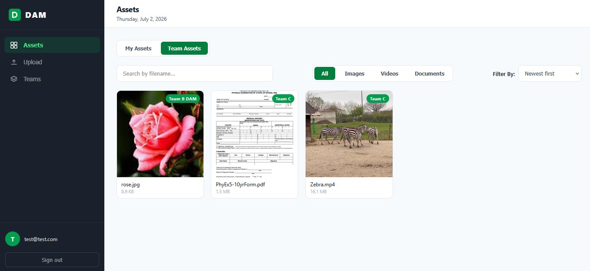

# Digital Asset Management (DAM)

A full-stack digital asset management platform — upload, organize, preview, and share images, videos, and PDFs. Built as an npm-workspaces monorepo with a Node.js/Express/TypeScript API and a React/Vite frontend.

## Monorepo Layout

├── backend/ # Express + TypeScript REST API, Sequelize, MinIO, RabbitMQ worker — see backend/README.md
├── frontend/ # React + Vite + TypeScript SPA
└── docker-compose.yml

## Features

- Email/password auth with JWT stored in an httpOnly cookie
- Drag-and-drop upload for images, videos, and PDFs (multi-file, up to 50 MB each)
- Async processing pipeline (thumbnails, video renditions) via RabbitMQ + a background worker
- Asset gallery with search, sort, and filter, plus a "My Assets" view
- Teams: create teams, add/remove members, and share assets with a team at `view` or `download` permission
- Delete confirmation modal
- Please refer `backend/README.md` for details

## Tech Stack

| Frontend | React 19, Vite, TypeScript, Axios, react-toastify
| Backend | Node.js, Express, TypeScript
| Database | PostgreSQL (Sequelize ORM)
| Object Storage | MinIO (S3-compatible)
| Message Queue | RabbitMQ
| Media Processing | Sharp (thumbnails), FFmpeg (video), pdf-to-img (PDF thumbnails)
| Testing | Vitest + Testing Library (both workspaces)
| Tooling | ESLint, Prettier, Husky, lint-staged, commitlint

See [backend/README.md](backend/README.md) for the full API reference, DB models, and storage layout.

## Getting Started

### With Docker Compose (recommended)

Starts Postgres, MinIO, RabbitMQ, the backend API, the asset-processing worker, and the frontend together:

```bash
docker compose up
```

- Frontend: http://localhost:5173
- Backend API: http://localhost:3000
- MinIO console: http://localhost:9001
- RabbitMQ console: http://localhost:15672

Requires a `.env` file in `backend/` and `frontend/` (see `backend/README.md` for the backend variables; the frontend needs `VITE_API_BASE_URL`).

### Locally without Docker

Install all workspace dependencies from the repo root:

```bash
npm install
```

Run backend and frontend together in dev mode:

```bash
npm run dev
```

Run the asset-processing worker (separately, from `backend/`):

```bash
npm run worker:dev -w backend
```

Build both workspaces:

```bash
npm run build
```

Run all tests:

```bash
npm test
```

Lint / format:

```bash
npm run lint
npm run format
```

## Contributing

Commit messages are linted via `commitlint` (Conventional Commits) and `lint-staged` runs ESLint + Prettier on staged files through Husky's pre-commit hook.

## Application Preview


